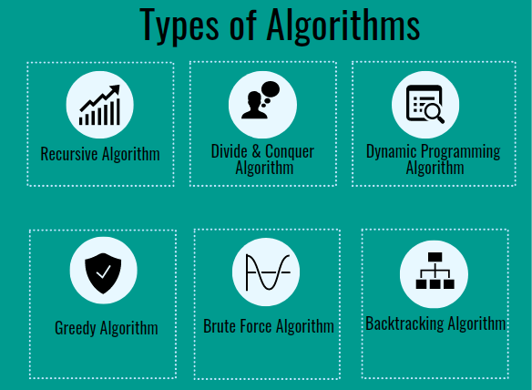

## Algorithms 

### Types of Algorithms:
- Recursive Algorithm
- Divide & Conquer Algorithm
- Dynamic Programming Algorithm
- Greedy Algorithm
- Brute Force Algorithm
- Backtracking Algorithm

 
 

