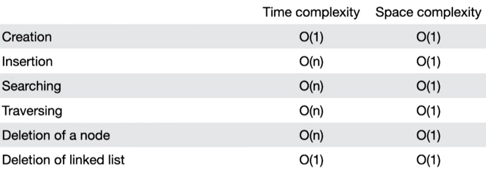

## Linked List

#### a linear data structure in computer science that consists of a sequence of nodes, where each node contains a data element and a reference (or link) to the next node in the sequence.
#### The linked list allows for efficient insertion and deletion operations at any position within the list, unlike arrays which have a fixed size.
#### Each node in a linked list contains two parts: the `data` and the `pointer` (or reference) to the next node.
#### The first node in the list is called the `head`, and the last node `points to null` <strong>or</strong> has a null reference, indicating the end of the list.
<br>

a simple example:
 ```
   Node             Node             Node
+-------+        +-------+        +-------+
| Data  |   -->  | Data  |   -->  | Data  |
|       |        |       |        |       |
| Next  |        | Next  |        | Next  |
+-------+        +-------+        +-------+
   Head             Node             Null
```

##### In this example, each node contains a data element and a pointer to the next node. The head points to the first node, and the last node points to null.
<br>

#### Linked lists can be used to implement various data structures and algorithms. 
#### Some common types of linked lists include:
<br>

- Singly linked list: 
   ##### Each node has a reference to the next node in the list.
<br>

- Doubly linked list: 
   ##### Each node has references to both the next and previous nodes in the list, allowing for traversal in both directions.
<br>

- Circular linked list: 
   ##### The last node in the list points back to the first node, forming a circular structure.
<br>

- Skip list: 
   ##### A linked list with multiple layers of nodes that allow for efficient searching and insertion.

<br>

#### Linked lists have certain advantages and disadvantages. 
#### The main advantages include dynamic size, efficient insertion and deletion at any position, and flexibility in memory allocation. 
#### However, they have some drawbacks, such as slower access to individual elements and increased memory overhead due to the storage of pointers.
<br>

---
<br>

### Linked lists vs Arrays

#### a comparison between linked lists and arrays:
<br>

- Memory Allocation: 
   - `Arrays` are allocated in contiguous memory locations, meaning that elements are stored one after another in memory. 
   - `linked lists` use dynamic memory allocation, where nodes can be scattered throughout the memory and are connected by pointers.

<br>

- Size: 
   - `Arrays` have a fixed size determined during their creation, <br>
   while `linked lists` can dynamically grow or shrink as elements are added or removed. 
   - This flexibility makes linked lists suitable for situations where the size of the data structure may change frequently.

<br>

- Memory Overhead: 
   - `Linked lists` have additional memory overhead due to the storage of pointers that maintain the connections between nodes. 
   - `Arrays` have a more compact representation since they only store the elements themselves. 
   Consequently, `linked lists` can consume more memory than `arrays` for the same number of elements.

<br>

- Contiguity: 
   - Elements in `arrays` are stored contiguously in memory, allowing for efficient CPU cache utilization and faster traversal. 
   - `Linked lists` do not have this property as their nodes can be scattered across memory locations, potentially resulting in cache misses and slower access times.

<br>

#### In summary, 
#### `arrays` are well-suited for scenarios where random access to elements by index is required, and the size of the data structure is known and fixed. 
#### `Linked lists` are preferable when frequent insertion and deletion operations are expected or when the size of the data structure needs to change dynamically.
<br>

---
<br>

### Time and Space Complexity of Singly Linked List.


<br>

---
<br>

### Time Complexity of Linked List vs Arrays.


<br>

---
---
---