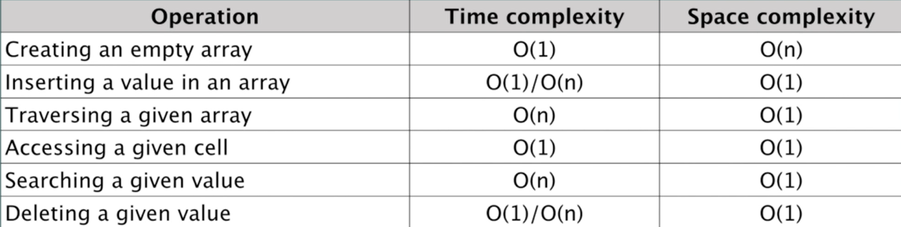
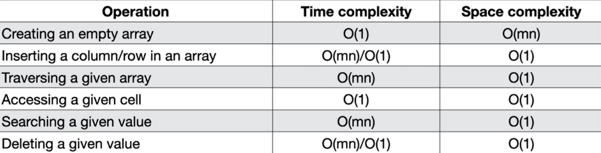

## Arrays

### What is an array ?

#### an array is a data structure consisting of a collection of elements,
#### each identified by at least one array index or key.

#### an array is stored such that the position of each element can computed from its index by mathematical formula. 

#### <strong>Or</strong>

#### An array is a data structure that stores a fixed-size sequence of elements of the same type. It is one of the most fundamental data structures in computer programming. The elements in an array are stored in contiguous memory locations, which allows for efficient access and manipulation of the data.

<br>
<br>

### Arrays advantages:
<br>

- Random access: 
##### Elements in an array can be accessed directly using their index, which allows for efficient retrieval of data.
<br>

- Compact storage: 
##### Arrays store elements in contiguous memory locations, resulting in efficient memory usage.
<br>

- Efficiency: 
##### Arrays facilitate efficient manipulation and processing of large sets of data due to their predictable memory layout.

<br>
<br>

### Why do we need an array ?
<br>

- Storing and organizing data: 
##### Arrays provide a way to store and organize collections of data in a structured manner. Whether it's a list of numbers, names, or any other type of information, arrays allow you to keep related data together and access it efficiently.
<br>

- Random access: 
##### Arrays enable efficient random access to individual elements based on their index. By knowing the index of an element, you can directly access it without having to search through the entire collection. This random access allows for quick retrieval, modification, or processing of data.
<br>

- Iteration and traversal: 
##### Arrays make it easy to iterate over the elements in a collection using loops. By sequentially accessing each element in the array, you can perform operations on them, such as printing, summing, sorting, or applying algorithms.
<br>

- Efficiency in memory usage: 
##### Arrays store elements in contiguous memory locations. This property makes arrays memory-efficient because they use a fixed amount of memory, regardless of the number of elements. This efficiency is especially important when dealing with large amounts of data.
<br>

- Multi-dimensional data: 
##### Arrays can have multiple dimensions, such as two-dimensional matrices or grids. They allow you to represent and manipulate complex data structures, such as tables, images, or graphs, in a straightforward manner.
<br>

- Algorithms and data manipulation: 
##### Arrays are a fundamental building block for many algorithms and data manipulation operations. Sorting, searching, filtering, and many other operations often rely on arrays for efficient implementation and execution.
<br>

- Interfacing with lower-level operations: 
##### Arrays provide a convenient way to interface with lower-level operations and systems, such as interacting with memory, file I/O, or network protocols. They allow you to represent and manipulate data in a format that is compatible with these operations.

<br>
<br>

### Types of array
<br>

- One-dimensional array: 
##### Also known as a linear array, it is the simplest form of an array that stores elements in a single row. Each element is accessed using a single index. For example, an array of integers [1, 2, 3, 4, 5] is a one-dimensional array.
<br>

- Two-dimensional array: 
##### A two-dimensional array, also called a matrix, consists of elements arranged in rows and columns, forming a grid-like structure. It is accessed using two indices, one for the row and another for the column. For example, a 3x3 matrix [[1, 2, 3], [4, 5, 6], [7, 8, 9]] is a two-dimensional array.
<br>

- Multi-dimensional array: 
##### A multi-dimensional array has more than two dimensions. It can have three or more indices for accessing elements. Multi-dimensional arrays are useful for representing complex data structures like cubes, tensors, or higher-dimensional spaces.
<br>

- Jagged array: 
##### A jagged array, also known as an array of arrays, is an array whose elements are themselves arrays. Unlike a multidimensional array, jagged arrays allow for different lengths of sub-arrays. Each sub-array can have a different number of elements. For example, [[1, 2], [3, 4, 5], [6, 7, 8, 9]] is a jagged array.
<br>

- Dynamic array: 
##### A dynamic array is a resizable array that can change its size dynamically during runtime. It automatically grows or shrinks as elements are added or removed. Dynamic arrays provide flexibility when the number of elements is not known in advance, and they are commonly used in languages that support them, like Python's lists or Java's ArrayList.
<br>

- Sparse array: 
##### A sparse array is an array where most of the elements have a default or null value. It is designed to optimize memory usage by only storing non-default or non-null values. Sparse arrays are useful when dealing with large collections with mostly empty or default values, as they reduce memory consumption.

<br>
<br>

---
<br>

### Arrays is python

#### The array module in Python provides a fixed-size array data type that is more memory-efficient compared to lists when storing large collections of homogeneous data. This module is particularly useful when dealing with numeric data.

<br>

- insert()
##### The insert() method is a built-in function in Python that allows you to insert an element at a specified position.
```
name.insert(index, element)
```
<br>

- remove()
##### The remove() method is a built-in function in Python that allows you to remove the first occurrence of a specified element
```
name.remove(element)
```
<br>

- append()
##### The append() method is a built-in function in Python that allows you to add an element to the end.
```
name.append(element)
```
<br>

- extend()
##### The extend() method is a built-in function in Python that allows you to append elements from another iterable (such as a list, tuple, or string) to the end. 
```
name.extend(iterable)
```
<br>

- pop()
##### The pop() method is a built-in function in Python that allows you to remove and retrieve an element from a specific position.
```
name.pop(element)
```
<br>

- index()
##### The index() method is a built-in function in Python that allows you to find the index of the first occurrence of a specified element.
```
name.index(element)
```
<br>

- reverse()
##### The reverse() method is a built-in function in Python that allows you to reverse the order of elements.
```
name.reverse()
```
<br>

- buffer_info()
##### The buffer_info() method is a method specific to the array module in Python. It returns a tuple containing information about the underlying buffer of an array object. 
##### This method provides details such as the address and size of the buffer, which can be useful for low-level operations.
```
name.buffer_info()
```
<br>

- count()
##### The count() method is a built-in function in Python that allows you to count the number of occurrences of a specified element.
```
name.count(element)
```
<br>

- tostring()
##### In Python, the tostring() method is not available for lists. However, if you are referring to the tostring() method in the array module, it is used to convert an array to a string of bytes.
```
name.tostring()
```
<br>

- "slice"
##### A slice is a way to extract a portion of a sequence, such as a string, list, or tuple, in Python. It allows you to specify a range of indices to retrieve a subset of the elements from the original sequence.
```
sequence[start:end:step]
```

<br>
<br>

### Time and Space complexity of One Dimensional Array:


<br>
<br>

---
<br>

### Numpy
#### a powerful numerical computing library.
#### provides functionality for working with large, multi-dimensional arrays and matrices, along with a collection of mathematical functions to operate on these arrays efficiently.
<br>

#### some key features and concepts of NumPy:
<br>

- Multi-dimensional arrays: 
##### NumPy provides an ndarray object, which is a multi-dimensional array of homogeneous data types. These arrays can have any number of dimensions and are highly efficient for performing mathematical operations.
<br>

- Mathematical operations: 
##### NumPy offers a wide range of mathematical functions that operate efficiently on arrays. These functions include basic arithmetic operations, trigonometric functions, exponential and logarithmic functions, linear algebra operations, random number generation, and more.
<br>

- Indexing and slicing: 
##### NumPy provides powerful indexing and slicing capabilities for accessing and manipulating data within arrays. You can use indexing to access individual elements or subsets of elements in an array based on their position.
<br>

- Broadcasting: 
##### Broadcasting is a powerful mechanism in NumPy that allows for arithmetic operations between arrays of different shapes. It simplifies computations by automatically expanding smaller arrays to match the shape of larger arrays.
<br>

- Vectorized operations: 
##### NumPy encourages the use of vectorized operations, which perform computations on entire arrays rather than using explicit loops. This approach is more efficient and concise, as it leverages highly optimized C and Fortran code behind the scenes.
<br>

- Integration with other libraries: 
##### NumPy integrates well with other scientific computing libraries in Python, such as SciPy (for scientific computations), Matplotlib (for plotting and visualization), and pandas (for data manipulation and analysis).

<br>
<br>

### Time and Space complexity of Two Dimensional Array:


<br>
<br>

---

### When to use\avoid Arrays
<br>

#### When to use:
- Sequential access: 
##### Arrays provide efficient sequential access to elements based on their indices. If you need to access elements in a predictable order or perform operations like sorting or searching, arrays can be a good choice.
<br>

- Fixed-size collection: 
##### If you know the exact number of elements you need to store in advance and it won't change, arrays can be a suitable option. They have a fixed size, which can be advantageous in terms of memory efficiency and performance.
<br>

- Homogeneous data: 
##### If you have a collection of elements that are all of the same data type, arrays can provide a straightforward way to store and access them.

<br>

#### When to avoid:
- Dynamic size requirements: 
##### If the number of elements you need to store can change dynamically, arrays may not be the best choice. Resizing an array can be inefficient, as it often requires allocating a new array and copying elements.
<br>

- Insertion and deletion: 
##### If you frequently need to insert or delete elements within a collection, arrays may not be the most efficient data structure. Shifting elements to accommodate changes can be time-consuming.
<br>

- Heterogeneous data: 
##### If you need to store elements of different types or structures, arrays may not be suitable. Other data structures like lists or dictionaries that allow for flexible data types can be more appropriate.
<br>

---
---
---