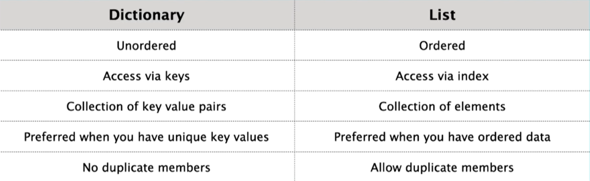
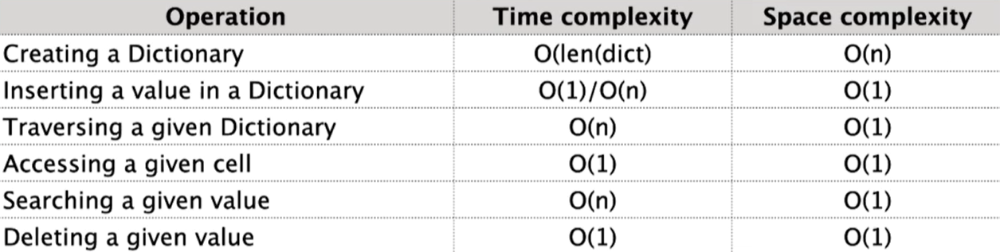

## Dictionaries

#### dictionaries are data structures that store key-value pairs.
#### They are also known as associative arrays or hash maps in other programming languages.
#### Dictionaries in Python are unordered, mutable (you can change, add, or remove key-value pairs), and can be indexed using keys rather than numerical indices.
<br>
<br>

### hash table

#### A hash table, also known as a hash map,
#### a data structure that allows efficient storage and retrieval of key-value pairs.
#### It is widely used in computer science and programming to implement associative arrays or dictionaries.
<br>

#### the keys are mapped to indices in an underlying array using a hash function. 
#### This mapping allows for quick access to values based on their associated keys. 
#### The hash function takes the key as input and produces a unique index or hash code for that key. 
<br>

### basic overview of how a hash table works:

- The hash function takes the key and calculates a hash code, which is an integer value.
- The hash code is then mapped to an index within the underlying array using a process called hashing. This index is where the value associated with the key will be stored.
- If there is a collision (i.e., two or more keys produce the same hash code), a collision resolution mechanism is employed to handle it. Common collision resolution techniques include chaining (using linked lists or arrays) or open addressing (probing the next available slot).
- When retrieving a value, the key is provided to the hash table. The hash function calculates the hash code, and the corresponding index is used to access the value stored at that location.

<br>

#### Hash tables offer constant-time average-case complexity for insertion, deletion, and retrieval operations, making them efficient for large datasets. However, the performance of a hash table can degrade if there are too many collisions or if the hash function is not well-distributed.
<br>

---
<br>

### dictionary Methods:

- clear()  
##### a built-in function available for dictionaries. 
##### It is used to remove all key-value pairs from a dictionary, essentially emptying the dictionary.
```
dictionary.clear()
```
<br>

- copy()
##### a built-in function available for dictionaries. 
##### It is used to create a shallow copy of a dictionary.
```
new_dict = dictionary.copy()
```
<br>

- fromkeys() 
##### a built-in function available for dictionaries. 
##### It is used to create a new dictionary with specified keys and a default value for all the keys.
```
new_dict = dict.fromkeys(keys, value)
```
<br>

- get()
##### a built-in function available for dictionaries. 
##### It is used to retrieve the value associated with a given key from a dictionary. 
##### The advantage of using get() over direct key access is that it allows you to specify a default value to be returned if the key is not found in the dictionary.
```
value = dictionary.get(key, default)
```
<br>

- items() 
##### used to retrieve the key-value pairs of a dictionary as a sequence of tuples. 
##### Each tuple in the sequence represents a key-value pair, where the first element of the tuple is the key and the second element is the corresponding value.
```
items = dictionary.items()
```
<br>

- keys()
##### a built-in function available for dictionaries. 
##### It is used to retrieve a view object that contains all the keys present in the dictionary.
```
keys = dictionary.keys()
```
<br>

- popitem() 
##### a built-in function available for dictionaries. 
##### It is used to remove and return an arbitrary key-value pair from the dictionary as a tuple.
```
key, value = dictionary.popitem()
```
<br>

- setdefault() 
##### a built-in function available for dictionaries. 
##### It is used to retrieve the value associated with a given key from a dictionary. 
##### If the key is not found in the dictionary, setdefault() also allows you to set a default value for that key and add it to the dictionary.
```
value = dictionary.setdefault(key, default)
```
<br>

- pop()
##### a built-in function available for dictionaries. 
##### It is used to remove and return the value associated with a given key from the dictionary.
```
value = dictionary.pop(key, default)
```
<br>

- values() 
##### a built-in function available for dictionaries. 
##### It is used to retrieve a view object that contains all the values present in the dictionary.
```
values = dictionary.values()
```
<br>

- update() 
##### a built-in function available for dictionaries. 
##### It is used to update one dictionary with the key-value pairs from another dictionary or an iterable object (such as a list of tuples).
```
dictionary.update(other_dictionary)
or
dictionary.update(iterable)
```
<br>

---
<br>

### dictionary vs list

<br>

---
<br>

### Time and Space complexity of dictionary:


---
---
---