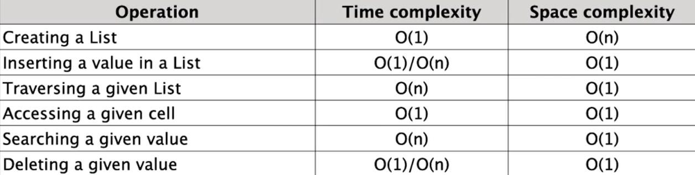

## Lists

#### lists are one of the built-in data structures that allow you to store and manipulate collections of items. 
#### Lists are ordered, mutable, and can contain elements of different types. 
 
 

---
 

### List vs Array

#### the terms "array" and "list" are often used interchangeably, but there are some differences between the two concepts.
 

#### Data Structure:
- List: 
##### A list in Python is a built-in data structure that can hold elements of different data types. It is a dynamic and ordered collection of items, allowing duplicates and supporting various operations like indexing, slicing, appending, and more. Lists are implemented as resizable arrays internally, which means they can grow or shrink as needed.
- Array: 
##### Arrays in Python are provided by external libraries such as NumPy and array module. They are fixed-size, homogeneous collections of elements of the same data type. Arrays offer high-performance operations on large datasets and support various mathematical operations.
 

#### Data Type:
- List: 
##### A list can store elements of different data types. For example, a list can contain integers, strings, or even other lists.
- Array: 
##### Arrays store elements of the same data type. If you create an array of integers, it can only store integers and not other data types.
 

#### Memory Efficiency:
- List: 
##### Lists in Python are more flexible in terms of memory usage since they can dynamically grow or shrink. However, this flexibility comes at the cost of slightly higher memory overhead.
- Array: 
##### Arrays are more memory-efficient compared to lists because they store elements in a contiguous block of memory. This results in better performance for large datasets but requires a fixed size during creation.
 

#### Performance:
- List: 
##### Lists provide a wide range of operations and methods, but they may not be as efficient as arrays when it comes to mathematical operations or processing large amounts of numerical data.
- Array: 
##### Arrays are optimized for numerical computations and offer efficient mathematical operations due to their homogeneous nature. They are widely used for scientific computing, data analysis, and other numerical tasks.
 
 

---
 

### List Methods:
 

- append()
##### Adds an element to the end of the list.
 

- extend()
##### Appends multiple elements to the end.
 

- insert()
##### Inserts an element at a specific index.
 

- remove()
##### Removes the first occurrence of an element.
 

- pop(empty)
##### Removes and returns the last element.
 

- pop(element)
##### Removes and returns the element at a specific index.
 

- index()
##### Returns the index of the first occurrence of an element.
 

- count()
##### Returns the number of occurrences of an element.
 

- sort(empty)
##### Sorts the list in ascending order.
 

- reverse(empty)
##### Reverses the order of elements in the list.
 

- split()
##### used to split a string into a list of substrings based on a specified delimiter.
 

- join()
##### used to concatenate elements of an iterable, such as a list, into a single string using a specified separator. 
 
 

---
 

### Time and Space complexity of Lists:

