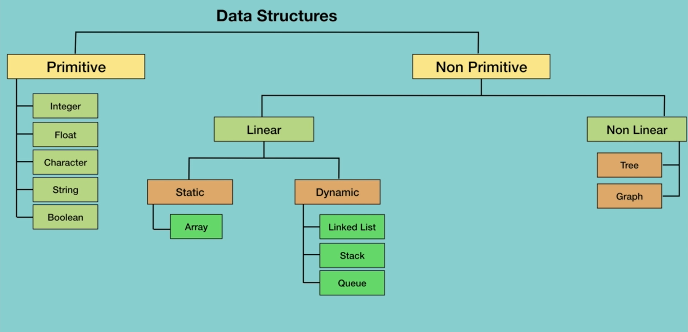

## Data Structures
 

### Types of Data Structures:
 
<ul>

<li>
<strong>Primitive</strong>
<ul>
 
<li>Integer</li>
<li>Float</li>
<li>Character</li>
<li>String</li>
<li>Boolean</li>
</ul>
</li>

 
 

<li>
<strong>Non Primitive</strong>
<ul>

 
<li>
Linear
<ul>

<li>Static
<ul> 
<li>Array</li>
</ul>
</li>

 

<li>Dynamic
<ul> 
<li>Linked List</li>
<li>Stack</li>
<li>Queue</li>
</ul>
</li>

</ul>
</li>

 

<li>
Non Linear
<ul>
<li>Tree</li>
<li>Graph</li>
</ul>
</li>

</ul>
</li>

</ul>
 
 

---
 