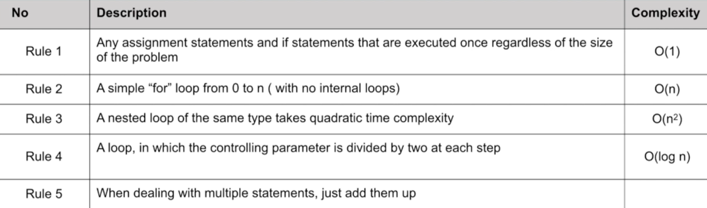

## Big O
 

#### the language and metric we use to describe the efficience of algorithms
#### <strong>or<strong>
#### mathematical notation used in computer science to describe the performance or complexity of an algorithm.
#### and it provides an upper bound on the growth rate of an algorithm's runtime or space requirements as the input size increases.
 

#### Here are some commonly used Big O notations and their corresponding performance characteristics:

- O(1): 
##### Constant time complexity. The algorithm's runtime does not depend on the input size.
- O(log n): 
##### Logarithmic time complexity. The algorithm's runtime grows logarithmically with the input size.
- O(n): 
##### Linear time complexity. The algorithm's runtime grows linearly with the input size.
- O(n log n): 
##### Log-linear time complexity. The algorithm's runtime grows in between linear and quadratic time.
- O(n^2): 
##### Quadratic time complexity. The algorithm's runtime grows quadratically with the input size.
- O(2^n): 
##### Exponential time complexity. The algorithm's runtime grows exponentially with the input size.
 
 

### How to measure the codes using Big O:

